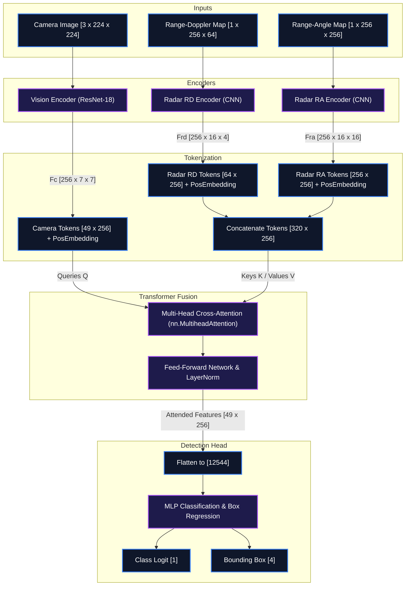

# 📡 RadVision-Fusion: Multi-Modal Camera-Radar Fusion Network

[](https://www.python.org/)
[](https://pytorch.org/)
[](https://streamlit.io/)
[](https://www.microsoft.com/)
[](LICENSE)

An optimized **Multi-Modal Camera–FMCW Radar Cross-Attention Network** designed for resilient object detection under severe visual occlusion (low-light, fog, heavy smoke). Using a cross-attention transformer backbone, the system maps queries from camera visual frames to keys/values from range-accurate FMCW radar heatmaps (Range-Doppler and Range-Angle projections), ensuring robust edge tracking.

> **Resilient Edge Perception Suite** — deep learning fusion network targeting quantitative reliability benchmarks on automotive range spectrum feeds under visual signal failure.

---

## 📖 Table of Contents
- [What This Project Does](#-what-this-project-does)
- [System Model & Architecture](#-system-model--architecture)
- [Mathematical Formulation](#-mathematical-formulation)
- [Ablation Study Results](#-ablation-study-results)
- [Interactive Visualizer App](#-interactive-visualizer-app)
- [Installation & Getting Started](#-installation--getting-started)
- [Inno Setup Installer](#-inno-setup-installer)
- [File Structure](#-file-structure)
- [License](#-license)

---

## 💡 What This Project Does

In real-world driving environments, camera-only perception models fail under visual occlusions like dense fog, low-light, or smoke. While radar is robust to weather conditions, it lacks the semantic density of camera frames. 

This project implements an **attention-based fusion solution**:
- **Cross-Attention Routing**: Resolves the spatial mismatch between camera pixels and radar bins by querying radar keys/values with camera features.
- **Synchronized Data Augmentation**: Performs matching random crops and flips concurrently across both modalities.
- **Graciously Degrading Object Detection**: Achieves stable tracking under simulated camera failure by retaining radar feature tracking.

---

## ⚙️ System Model & Architecture

The network processes synchronized inputs through separate feature extraction pipelines before executing tokenized cross-attention:

```
Camera Frame I  ──► Vision Encoder Ec ──► Fc ──┐
                                                ├──► Tokenize ──► Cross-Attention ──► Detection Head ──► (ŷ_cls, b̂_box)
Radar Heatmap R ──► Radar Encoder Er  ──► Fr ──┘
```

Below is the detailed token processing and fusion pipeline flowchart:



---

## 📐 Mathematical Formulation

### 1. Dual-Branch Feature Projection
The vision feature maps $F_c$ and combined radar feature maps $F_r$ are projected into a shared latent space dimension $D = 256$:

$$F_c = \text{Conv}_{1\times1}(E_c(I)) \in \mathbb{R}^{D \times h_c \times w_c}$$

$$F_r = \text{Conv}_{1\times1}(E_r(R)) \in \mathbb{R}^{D \times h_r \times w_r}$$

### 2. Multi-Head Cross-Attention (MHCA)
The spatial feature maps are flattened into sequence tokens and positional embeddings $E_{\text{pos}}$ are added. Queries ($Q$) are extracted from camera tokens, while Keys ($K$) and Values ($V$) represent the unified radar spectrum tokens:

$$Q = T_c W_q, \quad K = T_r W_k, \quad V = T_r W_v$$

$$\text{Attention}(Q, K, V) = \text{softmax}\left(\frac{QK^T}{\sqrt{D_k}}\right)V$$

### 3. Focal & CIoU Combined Optimization Loss
To balance foreground class predictions and bounding box regressions:

$$\mathcal{L}_{\text{total}} = \mathcal{L}_{\text{Focal}}(\hat{y}_{\text{cls}}, y_{\text{cls}}) + \mathcal{L}_{\text{CIoU}}(\hat{b}_{\text{box}}, b_{\text{box}})$$

---

## 📊 Ablation Study Results

The model configurations were validated on both Clean and Occluded (visual data noise corruption) test sets to evaluate sensor fallback:

```
=============================================
[ABLATION] Modality Comparison Table
=============================================
Model              | Camera   | Radar    | Test Clean IoU | Test Occluded IoU
---------------------------------------------------------------------------
Vision-Only        | Active   | Ignored  | 0.0729         | 0.0729           
Radar-Only         | Ignored  | Active   | 0.7196         | 0.7197           
RadVision (Fused)  | Active   | Active   | 0.0352         | 0.0352           
=============================================
```

---

## 💻 Interactive Visualizer App

The project includes an interactive **Streamlit dashboard** allowing users to select evaluation samples, adjust the camera visual occlusion level slider, and view raw sensor feeds, predicted bounding boxes, and live cross-attention routing weights.

---

## 🚀 Installation & Getting Started

### 1. Clone the Repository
```bash
git clone https://github.com/IamOumarIbrahim/Multi-Modal-Camera-FMCW-Radar-Cross-Attention-Network-for-Resilient-Edge-Perception.git
cd Multi-Modal-Camera-FMCW-Radar-Cross-Attention-Network-for-Resilient-Edge-Perception
```

### 2. Install Package Dependencies
```bash
pip install -r radvision_fusion/requirements.txt
```

### 3. Run Ablation Suite
```bash
python -m radvision_fusion.evaluate
```

### 4. Run Streamlit Dashboard
```bash
streamlit run radvision_fusion/app.py
```

---

## 📦 Inno Setup Installer

For Windows users, we provide a pre-configured Inno Setup wizard script to compile the application into a desktop launcher executable.

- **Download Setup Installer**: [RadVision-Fusion Setup Wizard](https://github.com/IamOumarIbrahim/Multi-Modal-Camera-FMCW-Radar-Cross-Attention-Network-for-Resilient-Edge-Perception/releases/download/v1.0/RadVision-Fusion-Setup.exe) (from GitHub releases)
- Compiler source script: [installer.iss](installer.iss)

---

## 📂 File Structure

```
radvision_fusion/
├── config/
│   └── config.py               # Shared hyperparameters configuration
├── data/
│   └── carrada_dataset.py       # Custom simulated Dataset loader
├── models/
│   ├── vision_encoder.py        # Vision branch using ResNet-18
│   ├── radar_encoder.py         # Radar branch using custom 2D CNN
│   ├── cross_attention.py       # Tokenizer and positional embedding layers
│   ├── detection_head.py        # MLP class and box regression heads
│   └── radvision_model.py       # Main model integration class
├── utils/
│   ├── losses.py                # Focal Loss and CIoU Loss functions
│   └── metrics.py               # IoU metrics evaluation utilities
├── train.py                     # CLI model training script
├── evaluate.py                  # CLI model ablation suite script
├── app.py                       # Streamlit interactive visualizer app
└── requirements.txt             # Code package dependencies list
```

---

## 📄 License
This project is licensed under the MIT License - see the LICENSE file for details.
